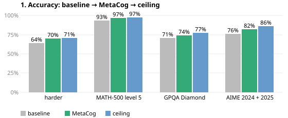
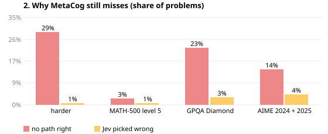
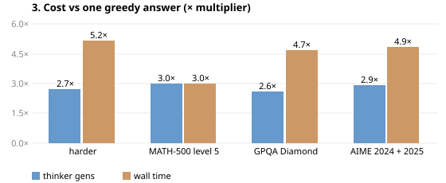
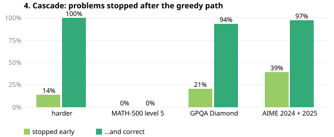

# MetaCog

**Let a small, fast decision model steer a bigger model's reasoning.**

MetaCog wraps any language model (local or API) in a *metacognition* loop: the model
branches into several thought paths, a System-One judge — [Jev](https://typesafe.ai) or
the open [Reflex](https://github.com/kshetrajna12/reflex) (4B, runs on your GPU) — picks
the most promising path in one ~100 ms forward pass, and the model continues down it.

```
problem ──▶ thinker samples n paths ──▶ judge picks one ──▶ thinker continues it ──▶ … ──▶ answer
                    ▲                         │
                    └─────────────────────────┘   (repeat until the winning path finishes)
```

## Status (Sep 2026)

The default pipeline is **adaptive**: greedy thought path → Jev confidence →
branch 2–6 full thought paths sized by judge uncertainty → Jev scores full paths
plus each distinct bare final answer (`answer_prior=0.5`) → pick. Measured live
on 180 paired rows (GPQA Diamond + AIME, three hosted thinkers) it lifts the
v0.2 default from 81.7 % to **86.7 %** (+11/−2, exact McNemar p=0.02) at 0.89×
wall time and 1.39× thinker tokens; the thinker alone scores 76.7 %. Pooled over
856 rows on 4 benchmarks, the earlier best-of-N configuration was already
75.0 % → 79.4 % vs the model alone. A no-API-key local judge (`LogitJudge`,
below) is shipped and statistically ties Jev (68 vs 72/127, p=0.50) — Jev
remains the default judge.

| | |
|---|---|
|  |  |
| Ceiling = some path was right. Gap MetaCog→ceiling is what a better judge could recover; gap ceiling→100% needs more/better paths. | 'No path right' → generate more or more diverse paths. 'Jev picked wrong' → improve the judge. Judge errors are the minority everywhere. |
|  |  |
| Generations ≈ token cost. Time is higher than generations because greedy → samples → judge run in sequence; parallelising stages is the speed lever. | Share of problems where Jev was ≥0.95 on the greedy answer so no samples were made, and how often that answer was right. Raising this share (without losing accuracy) is the cost lever. |

### Experiment ledger

Every configuration tested, paired on the same problems (live rows: GPQA
Diamond first 60 + AIME 60; DeepSeek V4 Flash, Kimi K2.5, GLM-5.3 Flash) plus
the judging-side tests replayed offline on saved pools. Live results are
fixed / lost vs the **v0.2 default** (best-of-N + greedy anchor + cascade) unless
stated otherwise; opt-in additions were also measured against the v0.3 default
they sit on top of, and that is the number that decided their verdict.

| idea | what it changes | rows | result (fixed / lost) | verdict |
|---|---|---|---|---|
| adaptive + answer prior | branch 2–6 full paths sized by judge uncertainty; judge also scores each bare final answer | 180 | 86.7 % vs 81.7 %, +11 / −2, p=0.02 | **promoted — the v0.3 default** |
| adaptive paths alone | the branching without the prior | 263 | +15 / −8, p=0.21 | folded into default |
| answer prior alone | the prior on top of best-of-N (offline: 83→93/119 picks) | 191 | +8 / −4, p=0.39 | folded into default |
| answer-group voting | sum scores per distinct answer, pick inside the winner | 213 pools (offline) | 130 vs 133 picks, +17/−20 | dropped |
| pairwise tie-break | `choice` call between top-2 within 0.05 | 213 pools (offline) | 132 vs 133 picks, +3/−4 | dropped |
| prefix judging / early pruning | judge 256–2048-token prefixes, prune early | 47 pools (offline) | worse: 31–36 vs 38 correct | dropped |
| stepwise 2-level tree | continuations at the leaves instead of full answers | 20 (pilot) | tie: 12/20 vs 12/20 | kept as `mode="stepwise"`, not default |
| local judge (LogitJudge, Qwen3.5-4B) | P(yes) from next-token logits, no API key | 127 pools (offline) | 68 vs Jev 72, +8/−12, p=0.50 | shipped, opt-in |
| calibrated judge ensemble | logistic meta-ranker over Jev text, bare-answer, answer-frequency and local-judge scores | 250 pools (offline; fit on A, read once on B) | no gain — learned weights reproduce the fixed 0.5 prior (B: 74 vs 73/98, +3/−2); answer frequency hurts held-out (70/98); local-judge fusion adds nothing (CV on A: 90 vs 90/152); Jev already calibrated (Brier 0.16) | dropped |
| diversity hints | each extra path gets a different approach prompt | 69 | +4 / −0 vs v0.2; **+2 / −3 vs v0.3** | opt-in `diversity_hints`, not promoted |
| escalate thinker | a stronger model writes one path when still unsure | 50 | +5 / −1 vs v0.2; **+3 / −3 vs v0.3**, 1.19× time | opt-in `escalate_thinker`, not promoted |
| triage | judge rates the bare problem; hard ones branch immediately | 205 | +12 / −5, p=0.14, 0.69× time | opt-in `triage` |
| adaptive sketches | 800-token outlines, kept 1–3 expanded | 256 | +14 / −8, p=0.29, 1.09× time | opt-in `sketch_tokens` |
| cheaper sketches | 500-token outlines, ≤2 expanded | 218 | +9 / −8, p=1.00 | dropped |
| wider & earlier stop | stop at 0.90, branch up to 8 | 23 | +0 / −0 | dropped |
| deep tree | prune sketches, re-branch up to 3 levels | 81 | +3 / −1, p=0.62, 1.51× time | dropped |

### What limits further gains

The misses chart shows the judge is near its ceiling: on most benchmarks only
1–4 % of problems are lost to a wrong pick, while up to ~29 % have *no correct
path at all* to pick. So the next gains are on the generation side — more or
more-diversified thought paths — and on scheduling: wall time runs ~5× a single
answer vs ~2.8× generations because greedy → samples → judge run in sequence,
so parallelising those stages is the speed lever.

## Measured

MiniCPM5-2B thinker, separate judge, oracle grading. Two task families, same pattern twice.

| arm | HumanEval (164 tasks, 6 candidates) | GSM8K (84/200 so far, 10 candidates) |
|---|---|---|
| thinker's single answer (no judge) | 0.555 | 0.738 |
| majority vote over candidates (no judge) | — | 0.833 |
| thinker judging its own candidates | 0.524 (worse than no judge) | — |
| **Reflex judge, per-candidate noul** (local, MIT, $0) | **0.689** | not yet run |
| Reflex judge, one-shot choice | 0.671 | — |
| Jev judge, one-shot choice | 0.726 | 0.869 |
| **Jev judge, per-candidate noul** | **0.756** | **0.905** |
| ceiling: any candidate passes | 0.793 | 0.976 |

The gain comes from *choosing*, not from thinking more: majority vote helps, a separate
judge helps more, and the thinker grading itself is worse than no judge at all. The
Reflex–Jev gap is within noise (McNemar p=0.11, n=164). Reflex rescued 36 % of the items
where the first answer failed. Judge confidence was *not* a usable "send to a human"
signal. Samples are modest — directional, not gospel. Full HumanEval table, provenance and
limits in [docs/METHOD.md](docs/METHOD.md).

## Live demo (any hosted model + Jev)

`examples/live_demo.py` wraps any OpenAI-compatible endpoint
(env `THINKER_URL` / `THINKER_MODEL` / `THINKER_KEY`, `PROBLEM_SET=hard`,
`OUT=file.json`) in MetaCog with Jev, and records baseline vs candidates vs the
judge's pick with full traces. `examples/render_demo.py 'runs/*.json' report.html
"title"` renders a self-contained HTML report.

One pass (Sep 2026) over 12 harder counting problems, 3 candidates each, Jev judging, no
cherry-picking of models or problems. Sanity check that the loop works on live models, not a
benchmark — most problems are too easy to separate the arms.

| thinker | baseline (1 greedy) | MetaCog (Jev pick of 3) | ceiling |
|---|---|---|---|
| deepseek/deepseek-v4-flash | 10/12 | **11/12** | 11/12 |
| xiaomi/mimo-v2.5 | 10/12 | **11/12** | 11/12 |
| z-ai/glm-5.3-flash | 10/12 | **11/12** | 12/12 |
| MiniMaxAI/MiniMax-M2.5 | 10/12 | 10/12 | 10/12 |
| meituan/LongCat-2.0 | 10/12 | 10/12 | 10/12 |
| stepfun/Step-3.5-Flash | 10/12 | 10/12 | 10/12 |
| moonshotai/Kimi-K2.5 | 11/12 | 11/12 | 11/12 |
| Qwen/Qwen3.8-Flash | 11/11 | 11/11 | 11/11 |
| zai-org/GLM-5.1 (provider dropped out) | 6/6 | 6/6 | 6/6 |
| Qwen/Qwen3.6-Plus (provider dropped out) | 3/3 | 3/3 | 3/3 |
| MiniCPM5-2B, local on a DGX Spark (12 easier problems) | 11/12 | **12/12** | 12/12 |

MetaCog never did worse than the baseline; every rescue was a problem where the baseline
was wrong and Jev picked a correct candidate out of a disagreeing set.
`greedy_anchor=True` now keeps the greedy answer in the candidate pool, so the judge can
never do worse than baseline for lack of the option — and the confidence cascade
(`cascade_confidence`, default on in the demo at 0.95) scores the greedy path first and
skips sampling entirely when it's that confident: measured, a noul ≥ 0.95 is correct
226/229 times.

### Standard benchmarks, 10 hosted thinkers (Sep 2026, partial)

Same loop on public benchmarks, 10 CommandCode-hosted thinkers in parallel, Jev judging,
`greedy_anchor` + cascade on, 3 paths (5 on AIME), raw chat completions with no tools.
Rows are pooled over models and paired (same model, same problem). Denominators are
partial — the provider's usage caps stopped the runs — so these are not full benchmark
scores; the comparison is baseline vs MetaCog on identical rows.

| benchmark | rows | baseline | MetaCog | ceiling (any path) | fixed / lost | McNemar p |
|---|---|---|---|---|---|---|
| custom harder counting | 134 | 0.642 | **0.701** | 0.709 | 10 / 2 | 0.039 |
| MATH-500 level 5 (integer) | 159 | 0.931 | **0.969** | 0.975 | 7 / 1 | 0.070 |
| GPQA Diamond | 372 | 0.707 | **0.742** | 0.772 | 23 / 10 | 0.035 |
| AIME 2024+2025 | 191 | 0.759 | **0.817** | 0.859 | 14 / 3 | 0.013 |
| pooled | 856 | 0.750 | **0.794** | — | 54 / 16 | 6e-6 |

Where the paths disagreed and at least one was right, Jev picked a correct one 224/245
times. Two hypotheses were tested and *not* adopted: judging 256–2048-token prefixes and
pruning early (worse than judging full text on 47 saved pools: 31–36 vs 38 correct), and a
2-level decision tree with full thoughts at the leaves (`mode="stepwise"`,
`finish_paths=True`) — on a MiniCPM pilot it tied best-of-N (12/20 vs 12/20, baseline 8)
at +7 % tokens and 1.8× judge calls.

## Install

```bash
pip install -e .              # core: httpx + pydantic only
pip install -e ".[eval]"      # + HumanEval harness
pip install -e ".[hf]"        # + local transformers thinker
```

## Use

```python
from metacog import MetaCog, Config, OpenAICompatThinker, SystemOneJudge

thinker = OpenAICompatThinker(
    "http://localhost:8000", model="openbmb/MiniCPM5-2B"
)  # vLLM / llama.cpp / Ollama / OpenAI
judge = SystemOneJudge.reflex(
    "http://localhost:8008"
)  # or SystemOneJudge.jev()  (uses $TYPESAFE_API_KEY)

mc = MetaCog(thinker, judge, Config(mode="stepwise", n_paths=4, step_tokens=256))
result = mc.run(
    "Write a Python function that returns the k-th smallest element of an unsorted list."
)

print(result.answer)
for r in result.trace.rounds:
    print(r.step, [f"{p:.2f}" for p in r.verdict.probabilities], "kept", r.kept)
```

Modes (`adaptive` is the default):

| mode | what happens | when |
|---|---|---|
| `adaptive` | greedy answer is the root; judge uncertainty `u = 1 − score` sets the branching factor `n_min..n_max`; an optional sketch level is judged and pruned, and only kept sketches are expanded into full solutions; with `max_rounds > 1` the tree keeps branching from the best answer until the judge is confident | **default** — the measured winner (v0.3 numbers above) |
| `best_of_n` | sample `n_paths` full answers, judge picks one | cheapest; works with any chat endpoint |
| `stepwise` | sample `n_paths` continuations of `step_tokens`, judge picks, extend, repeat | tighter steering; needs prefix continuation (vLLM `continue_final_message` or `/v1/completions`) |

The default pipeline: greedy thought path → Jev confidence → branch 2–6 thought paths
sized by uncertainty (`n_min`..`n_max`) → Jev scores full paths plus each distinct bare
final answer (`answer_prior=0.5`) → pick. A greedy path scored at
least `stop_confidence` (default 0.95) is returned immediately; otherwise `n_br =
round(n_min + u·(n_max − n_min))` branches open. With `sketch_tokens > 0` the branches
are cheap outlines judged under `SKETCH_JUDGE_INSTRUCTIONS` and pruned to
`round(1 + u·(expand_max − 1))` (dropping any more than `prune_margin` below the best);
only full solutions — the greedy root or expanded sketches — are ever the answer.
`triage=t` (e.g. `0.5`) adds a pre-step: Jev scores the bare problem's difficulty, and
problems below `t` skip the serial greedy stage entirely — the greedy root and the
level-0 branches are generated concurrently, sized from `u = 1 − easy` instead.

Judging strategy: `strategy="noul"` (default; one isolated "is this correct?" call per
candidate — the measured winner) or `strategy="choice"` (one comparative call, cheaper).
Set `split_generations=True` (default) to also harvest the alternative approaches a
thinker writes inside a single sample, and `commit_confidence=0.9` to stop branching once
the judge is sure (a cost knob — judge margins were *not* a usable abstention signal in the
measured pool).

`answer_prior=w` (default `0.5`; `None` disables) asks the judge to also score each
distinct bare final answer (`Final answer: X`, no reasoning) and adds `w ×` that noul
to each candidate's full-text score before picking — offline on saved disagreeing pools it
lifted correct picks from 83 to 93 of 119 (+14/−4).

CLI:

```bash
metacog solve "…problem…" --thinker-url http://localhost:8000 --thinker-model X --judge reflex
```

## Bring your own model

MetaCog never touches weights; it only needs something that can sample text.

| you have | use |
|---|---|
| vLLM / llama.cpp / Ollama / LM Studio / any OpenAI-compatible server | `OpenAICompatThinker(base_url, model)` |
| OpenAI, Together, Groq, OpenRouter, … | `OpenAICompatThinker("https://api.openai.com", model="gpt-4o-mini", api_key=…)` |
| a Hugging Face checkpoint in-process | `TransformersThinker("openbmb/MiniCPM5-2B")` (`pip install -e ".[hf]"`) |
| anything else | any object with `generate(problem, prefix, *, n, max_tokens, temperature, stop) -> list[Generation]` |

```python
from metacog import Generation


class MyThinker:
    def generate(self, problem, prefix, *, n, max_tokens, temperature, stop=None):
        texts = my_model.sample(
            problem + prefix, n=n, max_new_tokens=max_tokens, temperature=temperature
        )
        return [Generation(text=t, finished=True) for t in texts]


mc = MetaCog(MyThinker(), SystemOneJudge.jev(), Config(mode="best_of_n", n_paths=4))
```

`OpenAICompatThinker` tolerates imperfect servers: ones that ignore `n` (falls back to
sequential sampling), report `finish_reason="stop"` on truncated output (repaired from
`usage`), return HTTP 200 with an `{"error": …}` body, or drop the connection (retried).
If your server cannot continue a partial assistant message, use `mode="best_of_n"` or
`prefix_mode="prompt"`.

The judge is likewise pluggable: any object with `score(problem, candidates) -> Verdict`
(and `choose` for the comparative strategy) works. The one rule: **the judge must not be
the thinker** — self-grading measured worse than no judge.

## Evaluate

```bash
metacog-eval humaneval --thinker-url http://localhost:8000 --thinker-model X --judge none        # baseline
metacog-eval humaneval --thinker-url http://localhost:8000 --thinker-model X --judge reflex      # adaptive (v0.3) default
metacog-eval humaneval --thinker-url http://localhost:8000 --thinker-model X --judge reflex --mode stepwise --n 6
metacog-eval humaneval --thinker-url http://localhost:8000 --thinker-model X --judge local --judge-model Qwen3.5-4B.gguf
```

Adaptive knobs pass straight through to `Config`: `--stop-confidence` (0.95),
`--n-min`/`--n-max` (2/6), `--sketch-tokens` (0), `--expand-max` (3),
`--max-rounds` (1), `--triage`, `--answer-prior` (0.5, `none` disables),
`--greedy-anchor`, `--cascade-confidence`. `--judge local` takes a `.gguf` path
(`llama_cpp`) or `--judge-url` + `--judge-model` (OpenAI-compatible `top_logprobs`).

The harness runs model-generated code — use a container or VM. Always report the coverage
ceiling alongside accuracy and never let the thinker grade itself.

## Judges

Anything that speaks `POST /v1/systemone` (TypeSafe's schema):

- **Jev** — `SystemOneJudge.jev()`, hosted, `TYPESAFE_API_KEY` in the environment.
- **Reflex** — `uv run reflex-serve --model Qwen/Qwen3.5-4B --port 8008`, then
  `SystemOneJudge.reflex()`. MIT, Apache-2.0 weights, ~8 GB GPU.

### Local judge (no API key)

`LogitJudge` scores each candidate by reading P(yes) directly from a frozen open
model's next-token logits — one forward pass per path, no text generation (idea
credited to [SemIf](https://github.com/TheoLeeCJ/SemIf)):

```python
from metacog import LogitJudge, MetaCog, Config

judge = LogitJudge.llama_cpp("Qwen_Qwen3.5-4B-Q4_K_M.gguf")  # pip install -e ".[local]"
# or any OpenAI-compatible server that returns top_logprobs (vLLM, llama-server):
# judge = LogitJudge.openai_compat("http://localhost:8000", model="qwen")
mc = MetaCog(thinker, judge, Config())
```

**Measured.** Offline replay on 127 saved pools (tuning split) where the thought
paths disagree and both judges have scores: `LogitJudge` (Qwen3.5-4B Q4, CPU)
picks the correct path 68/127 vs Jev 72/127 (ceiling 100 — at least one path
correct). Head-to-head +8/−12, exact McNemar p=0.50: statistically a tie,
slightly weaker, in line with SemIf's reported Jev-agreement gap. `answer_prior`
gives no gain with the local judge (68→68) — keep it for Jev; answer-group
voting helps it modestly (73/127). Latency ≈2 min per 4-path pool on 8 CPU
cores vs seconds for Jev; use a GPU or llama-server for real use. Jev remains
the default judge.

## Develop

```bash
pip install -e ".[dev,eval]"
ruff check . && ruff format --check . && pytest -q
```

## License

MIT. Reflex is MIT (Kshetrajna Raghavan); Jev is a TypeSafe product. Not affiliated with
either.
